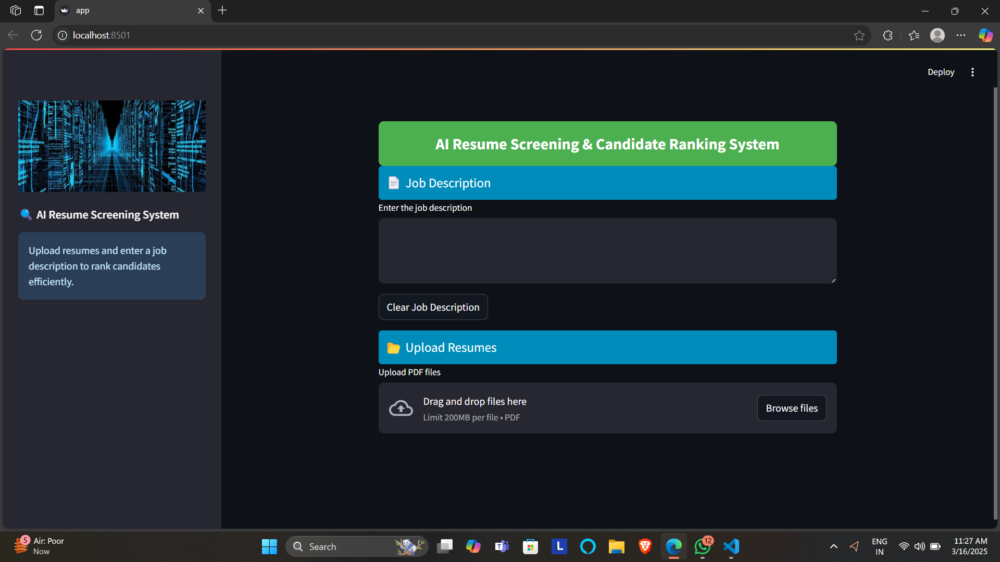

AI Resume Screening & Candidate Ranking System

🚀 AI-powered Resume Screening System that ranks candidates based on job descriptions using Natural Language Processing (NLP) and Machine Learning.

---

🖥 Live Demo

📌 [Deployment Link](https://ai-resume-ranking-iap4k7eqjefkxdl4zvkzsw.streamlit.app/)

---

📌 Features

✔ Upload Multiple Resumes (PDF format)
✔ Enter Job Description for comparison
✔ AI-based Resume Ranking using TF-IDF & Cosine Similarity
✔ Clear Job Description & Resume Files buttons
✔ Elegant UI with Sidebar & Styling

---

⚙ How It Works?

1️⃣ Upload multiple resumes (PDF)
2️⃣ Enter the job description in the text area
3️⃣ Click Submit to rank resumes based on similarity
4️⃣ View the ranked results in a table
5️⃣ Clear job description or resumes if needed

---

🛠 Tech Stack

🔹 Frontend: Streamlit
🔹 Backend: Python, NLP (TF-IDF), Machine Learning
🔹 Libraries:

Streamlit (UI Framework)

PyPDF2 (Extract text from PDFs)

sklearn (TF-IDF & Cosine Similarity)

pandas (Data Processing)

---

📂 Project Structure

📦 AI-Resume-Ranking
┣ 📜 app.py # Main Streamlit App
┣ 📜 requirements.txt # Required Python packages
┣ 📜 README.md # Documentation
┗ 📂 screenshots/ # Page Screenshots

---

🔧 Installation & Usage

1️⃣ Clone the Repository

git clone https://github.com/ANIRUDDH-EKANSH-PANDEY/AI-Resume-Ranking.git
cd AI-Resume-Ranking

2️⃣ Set Up Virtual Environment (Optional but Recommended)

python -m venv venv
source venv/bin/activate # macOS/Linux
venv\Scripts\activate # Windows

3️⃣ Install Dependencies

pip install -r requirements.txt

4️⃣ Run the Application

streamlit run app.py

📌 Open http://localhost:8501/ in your browser 🎯

---

📸 Screenshots

### 1️⃣ Home Page

### 2️⃣ Resume_Ranking Results

.png>)

---

🎯 Future Enhancements

✅ OCR Support for Scanned PDFs
✅ Integration with ATS (Applicant Tracking System)
✅ Support for Multiple File Formats (DOCX, TXT, etc.)
✅ Deployment on Cloud (AWS, GCP, or Heroku)

---

🤝 Contribution Guidelines

1️⃣ Fork this repository
2️⃣ Create a new branch (feature-xyz)
3️⃣ Commit your changes
4️⃣ Push to your branch & submit a Pull Request

📌 Open to PRs & Feature Requests! 🎯

---

📜 License

⚖ MIT License - Free to use and modify!

---

👨‍💻 Author

💡 Aniruddh Ekansh Pandey

## 📞 Contact

📧 _Email:_ [pandeyaniruddhekansh@gmail.com](mailto:pandeyaniruddhekansh@gmail.com)  
🔗 _LinkedIn:_ [Aniruddh Ekansh Pandey](https://www.linkedin.com/in/aniruddh-ekansh-pandey-447904258)

---
